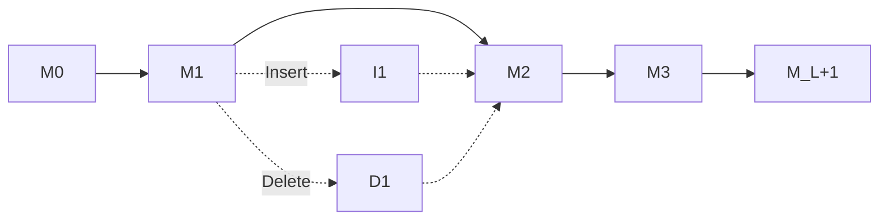

## Overview

HH-suite implements sophisticated algorithms for comparing Hidden Markov Models (HMMs) representing protein sequences. The core algorithms include:

- **Viterbi algorithm**: Finds optimal alignment path
- **Forward-Backward algorithms**: Calculate alignment probabilities
- **MAC (Maximum Accuracy)**: Posterior decoding for optimal expected accuracy

## HMM-HMM Comparison

### Profile HMM Structure

HH-suite uses profile HMMs with a linear topology:



<Info>
Each column (1 to L) contains:
- **Match state (M)**: Emits aligned residue
- **Insert state (I)**: Emits extra query residues
- **Delete state (D)**: Skips template residues
</Info>

### Pair States

Aligning two HMMs creates **pair states**:

| Pair State | Query State | Template State | Description |
|------------|-------------|----------------|-------------|
| MM | Match | Match | Both emit residues |
| GD | Gap | Delete | Query gap, template emits |
| IM | Insert | Match | Query insert, template emits |
| DG | Delete | Gap | Query emits, template gap |
| MI | Match | Insert | Query emits, template insert |

<Note>
Transitions only occur between MM state and the four other states (no direct I↔D transitions).
</Note>

## Viterbi Algorithm

The Viterbi algorithm finds the **single best alignment** between two HMMs using dynamic programming.

### Algorithm Description

Source: `hhviterbialgorithm.cpp`

<Steps>
  <Step title="Initialization">
    Initialize the top row (i=0) and leftmost column (j=0) of the dynamic programming matrix.
    
    ```cpp
    // Top row initialization
    for (j=0; j <= t->L; ++j) {
        sMM[j] = -j * penalty_gap_template;
        sGD[j] = -FLT_MAX;
        sIM[j] = -FLT_MAX;
    }
    ```
  </Step>
  
  <Step title="Recursion">
    For each cell (i,j), calculate scores for all pair states:
    
    **Match-Match (MM)**:
    ```
    sMM[i][j] = S(qi, tj) + max(
      sMM[i-1][j-1] + tr_MM_MM,
      sGD[i-1][j-1] + tr_GD_MM,
      sIM[i-1][j-1] + tr_IM_MM,
      sDG[i-1][j-1] + tr_DG_MM,
      sMI[i-1][j-1] + tr_MI_MM
    )
    ```
    
    Where `S(qi, tj)` is the emission score (scalar product of emission probabilities).
  </Step>
  
  <Step title="Traceback">
    Follow backtrace pointers from the maximum score to reconstruct the alignment path.
  </Step>
</Steps>

### SIMD Vectorization

HH-suite processes **4-8 alignments in parallel** using SIMD instructions:

<Tabs>
  <Tab title="SSE2">
    ```cpp hhviterbi.h
    // Process 4 alignments simultaneously
    const int VECSIZE_FLOAT = 4;
    
    simd_float sMM_i_j;
    simd_float score_vec = simdf32_set(-FLT_MAX);
    ```
  </Tab>
  
  <Tab title="AVX2">
    ```cpp SIMD operations
    // Process 8 alignments simultaneously
    const int VECSIZE_FLOAT = 8;
    
    // Scalar product (20 amino acids)
    simd_float ScalarProd20Vec(simd_float* qi, simd_float* tj) {
        simd_float res0 = simdf32_mul(tj[0], qi[0]);
        simd_float res1 = simdf32_mul(tj[1], qi[1]);
        // ... accumulate products
        return simdf32_add(res0, res1);
    }
    ```
  </Tab>
</Tabs>

### Secondary Structure Scoring

SS scoring is integrated into the Viterbi alignment:

```cpp hhviterbi.h
static inline float ScoreSS(
    const HMM* q, const HMM* t, 
    const int i, const int j, 
    const float ssw, const int ssm,
    const float S73[NDSSP][NSSPRED][MAXCF],
    const float S37[NSSPRED][MAXCF][NDSSP],
    const float S33[NSSPRED][MAXCF][NSSPRED][MAXCF]
) {
    switch (ssm) {
        case HMM::NO_SS_INFORMATION:
            return 0.0;
        case HMM::PRED_DSSP:  // Query predicted, template DSSP
            return ssw * S37[q->ss_pred[i]][q->ss_conf[i]][t->ss_dssp[j]];
        case HMM::DSSP_PRED:  // Query DSSP, template predicted
            return ssw * S73[q->ss_dssp[i]][t->ss_pred[j]][t->ss_conf[j]];
        case HMM::PRED_PRED:  // Both predicted
            return ssw * S33[q->ss_pred[i]][q->ss_conf[i]]
                            [t->ss_pred[j]][t->ss_conf[j]];
    }
    return 0.0;
}
```

<Info>
**SS scoring modes**:
- `PRED_DSSP`: Query has predicted SS, template has DSSP
- `DSSP_PRED`: Query has DSSP, template has predicted SS  
- `PRED_PRED`: Both have predicted SS
</Info>

### Cell-Off Optimization

The "cell-off" mechanism excludes regions from alignment:

```cpp hhviterbialgorithm.cpp
#ifdef VITERBI_CELLOFF
// Check if cell should be excluded
if (celloff_matrix.getCellOff(i, j, elem)) {
    sMM[i][j] = -FLT_MAX;  // Exclude this cell
}
#endif
```

Use cases:
- Prevent self-alignments with |i-j| < threshold
- Exclude previously found alignments
- Enforce minimum overlap constraints

## Forward-Backward Algorithms

### Forward Algorithm

Calculates the probability of all alignment paths **up to position (i,j)**.

Source: `hhforwardalgorithm.cpp`

```cpp Forward recursion (simplified)
// F_MM[i][j] = probability of all paths ending at (i,j) in state MM
for (i = 2; i <= q.L; ++i) {
    for (j = 1; j <= t.L; ++j) {
        double pmatch = ProbFwd(q.p[i], t.p[j]) * Cshift
                       * fpow2(ScoreSS(&q, &t, i, j, ssw, ssm));
        
        F_MM[i][j] = pmatch * (
            F_MM[i-1][j-1] * q.tr[i-1][M2M] * t.tr[j-1][M2M] +
            F_GD[i-1][j-1] * t.tr[j-1][D2M] +
            F_IM[i-1][j-1] * q.tr[i-1][I2M] * t.tr[j-1][M2M] +
            F_DG[i-1][j-1] * q.tr[i-1][D2M] +
            F_MI[i-1][j-1] * t.tr[j-1][I2M]
        );
    }
}
```

<Warning>
**Numerical Stability**: Forward probabilities can underflow. HH-suite uses **scaling** to maintain precision:
```cpp
scale[i] = 1.0 / max(F_MM[i][:]);
for (j in columns) {
    F_MM[i][j] *= scale[i];
}
```
</Warning>

### Backward Algorithm

Calculates the probability of all alignment paths **from position (i,j) to the end**.

Source: `hhbackwardalgorithm.cpp`

```cpp Backward recursion (simplified)
// B_MM[i][j] = probability of paths from (i,j) to end
for (i = q.L - 1; i >= 1; i--) {
    for (j = t.L - 1; j >= 1; j--) {
        double pmatch = B_MM[i+1][j+1]
                       * ProbFwd(q.p[i+1], t.p[j+1]) * Cshift
                       * fpow2(ScoreSS(&q, &t, i+1, j+1, ssw, ssm));
        
        B_MM[i][j] = (
            pmin +  // Local alignment: can end here
            pmatch * q.tr[i][M2M] * t.tr[j][M2M] +
            B_GD[i][j+1] * t.tr[j][M2D] +
            B_IM[i][j+1] * q.tr[i][M2I] * t.tr[j][M2M] +
            B_DG[i+1][j] * q.tr[i][M2D] +
            B_MI[i+1][j] * q.tr[i][M2M] * t.tr[j][M2I]
        );
    }
}
```

### Posterior Probabilities

Combining Forward and Backward:

```cpp
P_MM[i][j] = F_MM[i][j] * B_MM[i][j] / P_forward
```

Where `P_forward` is the total alignment probability.

<Info>
`P_MM[i][j]` = probability that positions i and j are aligned in state MM across **all possible alignments**.
</Info>

## MAC Algorithm (Maximum Accuracy)

MAC finds the alignment with **maximum expected accuracy** using posterior probabilities.

Source: `hhmacalgorithm.cpp`, `hhposteriordecoder.h`

### Algorithm Overview

<Steps>
  <Step title="Compute Posteriors">
    Run Forward-Backward to get `P_MM[i][j]`
  </Step>
  
  <Step title="MAC Recursion">
    ```cpp
    // S[i][j] = expected accuracy up to (i,j)
    S[i][j] = max(
        S[i-1][j],              // Delete in query
        S[i][j-1],              // Insert in query
        S[i-1][j-1] + P_MM[i][j] - mact  // Match
    );
    ```
    
    The `mact` parameter controls greediness:
    - Higher `mact`: shorter, more confident alignments
    - Lower `mact`: longer, more greedy alignments
  </Step>
  
  <Step title="Traceback">
    Follow the maximum expected accuracy path
  </Step>
</Steps>

### MAC vs Viterbi

<CardGroup cols={2}>
  <Card title="Viterbi" icon="arrow-up-right-dots">
    - Finds **single best** path
    - Maximizes joint probability
    - Faster computation
    - Can be overconfident
  </Card>
  
  <Card title="MAC" icon="bullseye">
    - Maximizes **expected accuracy**
    - Considers all possible paths
    - More reliable boundaries
    - Requires Forward-Backward
  </Card>
</CardGroup>

<Tip>
Use `-realign` flag to apply MAC algorithm to Viterbi hits:
```bash
hhsearch -i query.a3m -d pdb70 -realign -mact 0.35 -o results.hhr
```
</Tip>

## Alignment Path Representation

### State Encoding

From `hhdecl.h`:

```cpp
enum pair_states {
    STOP = 0,
    MM = 2,   // Match-Match
    GD = 3,   // Gap-Delete
    IM = 4,   // Insert-Match
    DG = 5,   // Delete-Gap
    MI = 6    // Match-Insert
};
```

### Backtrace Structure

```cpp hhviterbi.h
struct BacktraceResult {
    int* i_steps;      // Query positions
    int* j_steps;      // Template positions
    char* states;      // Pair states (MM/GD/IM/DG/MI)
    int count;         // Number of steps
    int matched_cols;  // Number of MM states
};
```

## Performance Optimizations

### SIMD Vectorization

Key optimizations in `hhviterbi.cpp`:

<AccordionGroup>
  <Accordion title="Scalar Product (20 amino acids)">
    ```cpp hhviterbi.h
    // Vectorized scoring for 20 amino acid types
    simd_float ScalarProd20Vec(simd_float* qi, simd_float* tj) {
        simd_float res0 = simdf32_mul(tj[0], qi[0]);
        simd_float res1 = simdf32_mul(tj[1], qi[1]);
        // ... process all 20 types
        res0 = simdf32_add(res0, res1);
        return res0;
    }
    ```
  </Accordion>
  
  <Accordion title="Prefetching (x86 only)">
    ```cpp
    #if defined(SSE)
    _mm_prefetch((char*)&qi[4], _MM_HINT_T0);
    _mm_prefetch((char*)&tj[4], _MM_HINT_T0);
    #endif
    ```
  </Accordion>
  
  <Accordion title="Multiple Algorithm Variants">
    HH-suite compiles separate libraries for different feature combinations:
    - `hhviterbialgorithm` (base)
    - `hhviterbialgorithm_with_celloff` (with exclusion)
    - `hhviterbialgorithm_with_celloff_and_ss` (exclusion + SS scoring)
    
    This avoids runtime branching in the inner loop.
  </Accordion>
</AccordionGroup>

### Memory Layout

Optimized cache access:

```cpp hhviterbi.h
// Store all DP states in single array for cache locality
simd_float* sMM_DG_MI_GD_IM_vec;
// Layout: [sMM|sDG|sMI|sGD|sIM] for each column
```

## Complexity Analysis

### Time Complexity

| Algorithm | Complexity | Notes |
|-----------|------------|-------|
| Viterbi | O(L_q × L_t) | L_q = query length, L_t = template length |
| Forward | O(L_q × L_t) | Same as Viterbi |
| Backward | O(L_q × L_t) | Same as Viterbi |
| MAC | O(L_q × L_t) | Requires F+B first |

<Info>
**SIMD speedup**: ~4-8× faster with vectorization
</Info>

### Space Complexity

- **Viterbi**: O(L_t) per alignment (only stores one row)
- **Forward-Backward**: O(L_q × L_t) (stores full matrix for posteriors)
- **Backtrace**: O(L_q × L_t) (stores backtrace pointers)

## Practical Implications

<CardGroup cols={2}>
  <Card title="Speed vs Accuracy" icon="gauge-high">
    - Use Viterbi-only for fast searches
    - Add `-realign` for critical alignments
    - MAC improves boundary detection
  </Card>
  
  <Card title="Memory Constraints" icon="memory">
    - Viterbi: minimal memory
    - MAC: needs ~8 bytes × L_q × L_t
    - Use `-maxmem` to limit realignment
  </Card>
</CardGroup>

## References

<CardGroup cols={2}>
  <Card title="HH-suite3 Paper" icon="file-lines" href="https://doi.org/10.1186/s12859-019-3019-7">
    Steinegger et al., BMC Bioinformatics (2019)
  </Card>
  
  <Card title="Source Code" icon="github" href="https://github.com/soedinglab/hh-suite">
    View implementation on GitHub
  </Card>
</CardGroup>

## Next Steps

<CardGroup cols={2}>
  <Card title="Parameters" icon="sliders" href="/advanced/parameters">
    Learn how to tune algorithm parameters
  </Card>
  <Card title="Compilation" icon="hammer" href="/advanced/compilation">
    Build with optimal SIMD flags
  </Card>
</CardGroup>